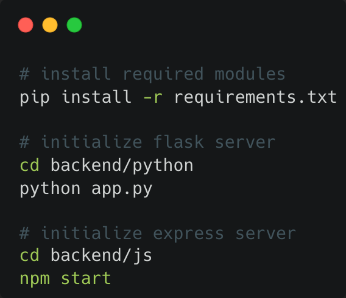
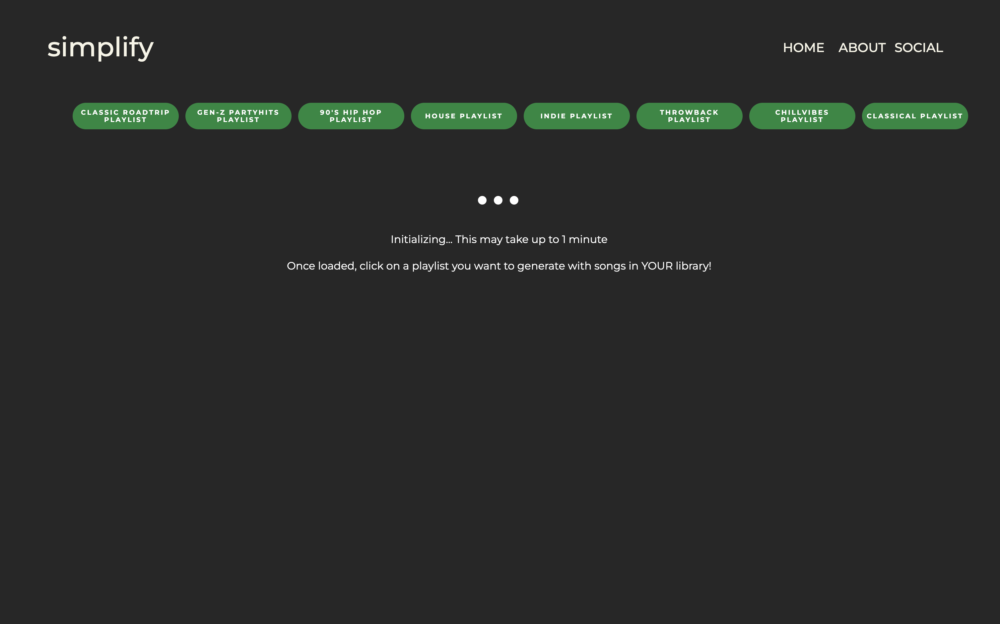
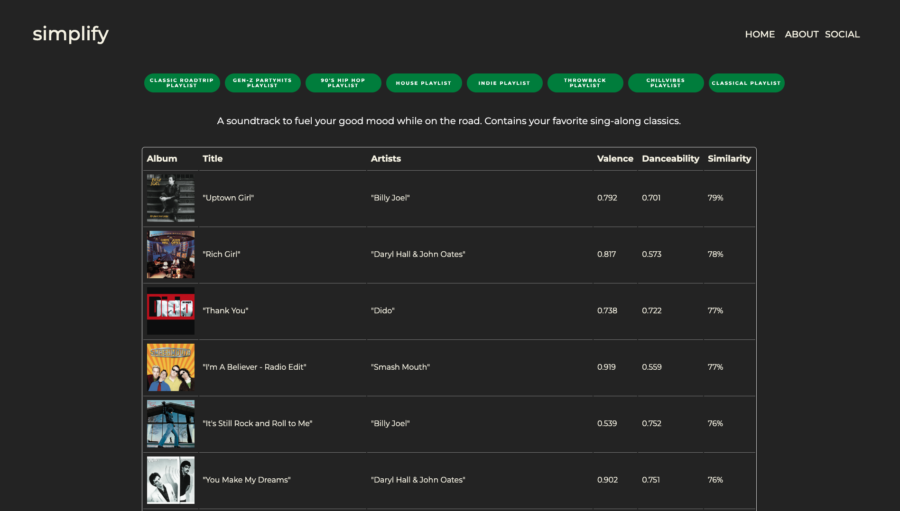
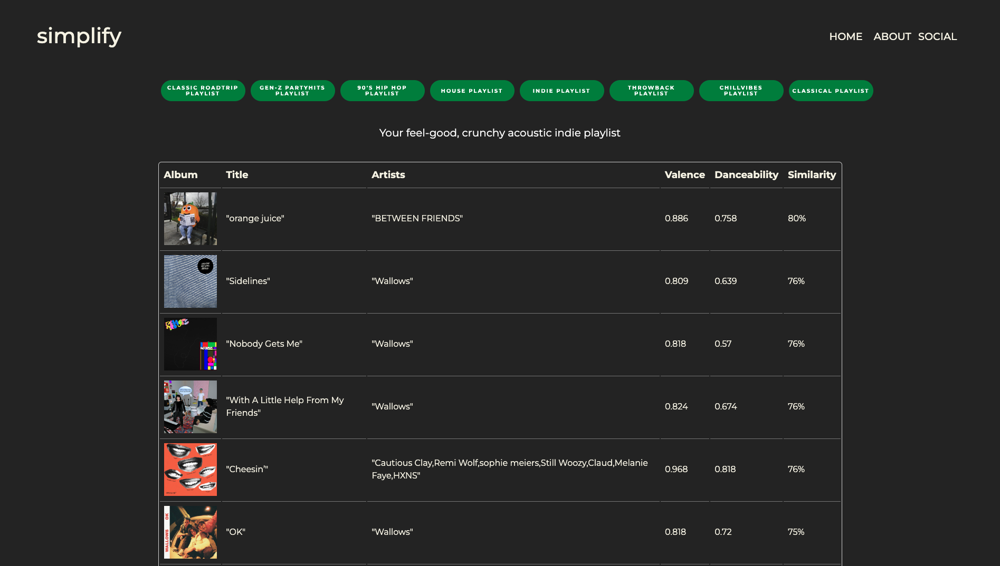
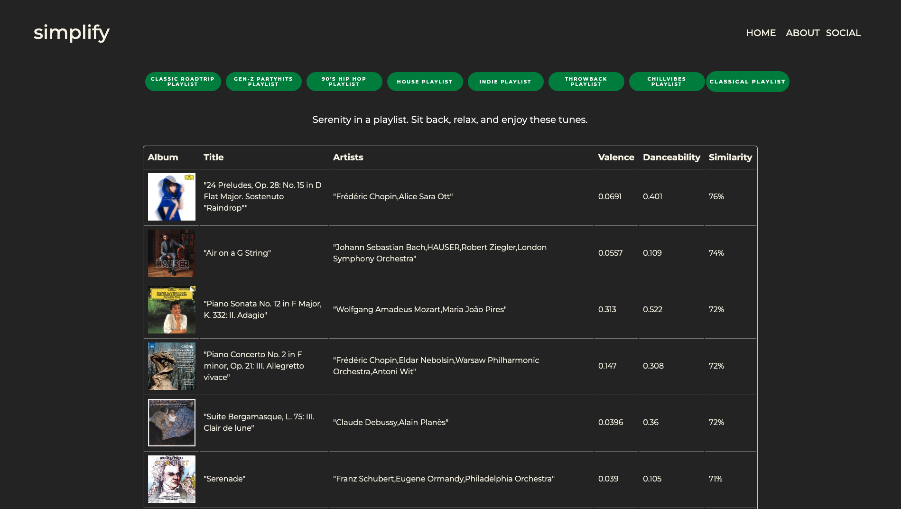
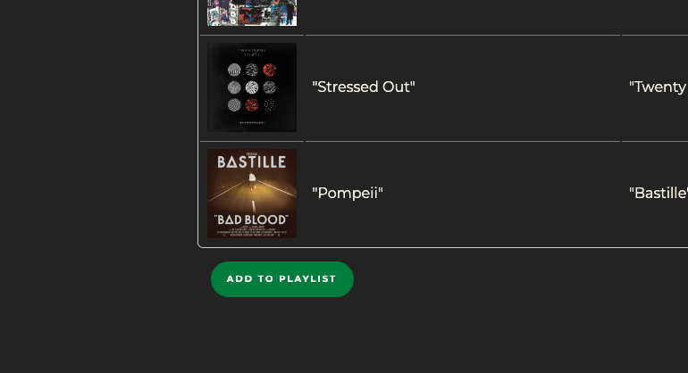
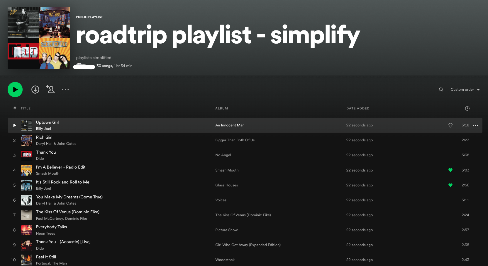

<!-- PROJECT LOGO -->
 

  
  

    <a href="#demo">View Demo</a>
  

<!-- ABOUT THE PROJECT -->
## Installation and usage
1. Initialize backend servers
    
&emsp;&emsp;
   
3. Initialize web server
    - Install [MAMP](https://www.mamp.info/en/downloads/)
    - Import the contents of the frontend folder into the root MAMP folder
    - Start up MAMP and open **index.html** on your browser by visiting https://localhost:3000 (note: port may depend on your MAMP installation)
  
## Description
Simplify is a web application that generates playlists based on algorithmic compatibility scores between users’ listening data and the current top 100s of different music categories. The similarity score is computed using cosine similarity between the generated feature vector of the current top-100s and user's listening data. To extract the feature vector, data was cleaned, standardized, and normalized using methods such as One Hot Encoding (e.g., for release year), TF-IDF (e.g., for genres), and Min-max Scaling.

## Demo

<ol>
  <h3><li>Once on the landing page, click "Get Started".</li></h3>

    

  <h3><li>You will be prompted to log in to your Spotify.</li></h3>
  

    

  
  <h3><li>Once logged in, it will take up to a minute to initialize.</li></h3>

    

  <h3><li>Click through the green buttoned options to select the playlist of your choice.</li></h3>

    
    
    

<h3><li>To add the playlist to your Spotify Library, scroll down and click "Add to Playlist".</li></h3>

    

  
<h3><li>Go to your Spotify Playlist Library and enjoy!</li></h3>

    

(<a href="#readme-top">back to top</a>)

