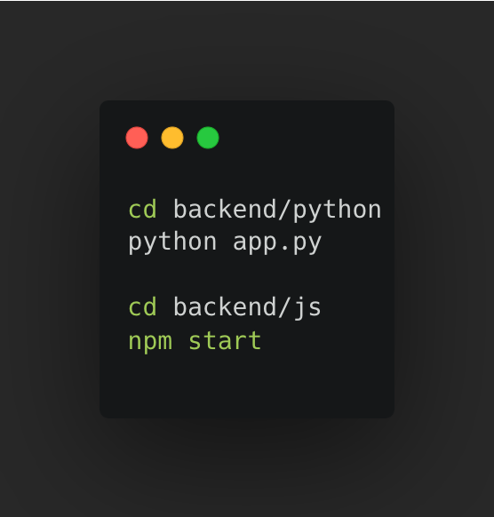

<a href="https://www.linkedin.com/in/yamato-eguchi">![LinkedIn][LinkedIn-Shield]</a>

<!-- PROJECT LOGO -->
 

  
  

    <a href="#demo">View Demo</a>
  

<!-- ABOUT THE PROJECT -->
## Installation and usage
1. Initialize backend servers
   
   
3. Initialize web server
   Install [MAMP](https://www.mamp.info/en/downloads/)
   Open the root MAMP folder and open index.html on your web browser

## The Challenge
Playlist creation can be a daunting and time-consuming task. Crafting the perfect collection of songs that encapsulates a particular mood or ambiance often takes hours of searching and curating. We've all been there. While public playlists offer a solid starting point, they might cater to something other than our specific preferences and interactions with music.

## The Solution
To address this challenge, I've harnessed the capabilities of the Spotify API and leveraged data science techniques to create a solution that simplifies and enhances playlist creation. The heart of the solution lies in generating playlists tailored to your individual musical journey and interactions.

## Features
Personalization: The web app seamlessly connects with your Spotify account, giving you a personalized playlist-generation experience.
Intelligent Song Selection: The app identifies songs that match your chosen criteria using a blend of data science methodologies, including TF-IDF analysis on track genres and cosine similarity ranking.
Effortless Integration: Once the playlist is generated, you have the option to add it directly to your Spotify library, making it a convenient tool for both playlist starters and those in need of an on-the-go playlist.

 
<!--
## Post Retrospective
### Successes
Here are a few milestones I hit during the three months of developing this app:
<ul>
  <li>
    Learned four new languages: <b>Python, JavaScript, HTML, CSS</b>
  </li>
  <li>
    Learned the foundation of both frontend and backend programming in web development, and applied them
  </li>
  <li>
    Applied the steps involved in data analysis: data retrieval, data cleaning, data processing and intrepretation of results
  </li>
  <li>
    Learned the importance of receiving user input and feedback
  </li>
</ul>

### Failures
I had many roadblocks and failures while developing the app. I failed to:
<ul>
  <li>
    Implement a secure database
  </li>
  <li>
    Maximize efficiency - app takes up to 30 seconds to initialize
  </li>
  <li>
    Have complete error handling
  </li>
  <li>
    Store user information securely
  </li>
</ul>
I have looked into each issues, and have began implementing solutions in other projects.

### Key take aways
Prior to this project, I had no web-development or data science experience. However, within three months, I was able to create a functioning product that applies both. Although not perfect, I learned many valuable lessons that I can apply to future projects. The following are my key take-aways:
<ul>
  <li>
    Know what you don't know
  </li>
  <li>
    Set realistic goals and stick to them
  </li>
  <li>
    Focus on the right things
  </li>
  <li>
    Think about the users
  </li>
  <li>
    Garbage in, garbage out
  </li>
  <li>
    Learn to learn <b>fast</b>!
  </li>
  <li>
    Read. The. Docs!
  </li>
</ul>

-->

<!-- CONTACT -->
## Contact
For any questions in regards to my project, please contact me.

Yamato Eguchi - [@yeguchi_dev](https://twitter.com/yeguchi_dev)

 

<!-- MARKDOWN LINKS & IMAGES -->
<!-- https://www.markdownguide.org/basic-syntax/#reference-style-links -->
[contributors-shield]: https://img.shields.io/github/contributors/github_username/repo_name.svg?style=for-the-badge
[contributors-url]: https://github.com/github_username/repo_name/graphs/contributors
[forks-shield]: https://img.shields.io/github/forks/github_username/repo_name.svg?style=for-the-badge
[forks-url]: https://github.com/github_username/repo_name/network/members
[stars-shield]: https://img.shields.io/github/stars/github_username/repo_name.svg?style=for-the-badge
[stars-url]: https://github.com/github_username/repo_name/stargazers
[issues-shield]: https://img.shields.io/github/issues/github_username/repo_name.svg?style=for-the-badge
[issues-url]: https://github.com/github_username/repo_name/issues
[license-shield]: https://img.shields.io/github/license/github_username/repo_name.svg?style=for-the-badge
[license-url]: https://github.com/github_username/repo_name/blob/master/LICENSE.txt
[linkedin-shield]: https://img.shields.io/badge/-LinkedIn-black.svg?style=for-the-badge&logo=linkedin&colorB=555
[linkedin-url]: https://linkedin.com/in/linkedin_username
[product-screenshot]: images/screenshot.png
[Next.js]: https://img.shields.io/badge/next.js-000000?style=for-the-badge&logo=nextdotjs&logoColor=white
[Next-url]: https://nextjs.org/
[React.js]: https://img.shields.io/badge/React-20232A?style=for-the-badge&logo=react&logoColor=61DAFB
[React-url]: https://reactjs.org/
[Vue.js]: https://img.shields.io/badge/Vue.js-35495E?style=for-the-badge&logo=vuedotjs&logoColor=4FC08D
[Vue-url]: https://vuejs.org/
[Angular.io]: https://img.shields.io/badge/Angular-DD0031?style=for-the-badge&logo=angular&logoColor=white
[Angular-url]: https://angular.io/
[Svelte.dev]: https://img.shields.io/badge/Svelte-4A4A55?style=for-the-badge&logo=svelte&logoColor=FF3E00
[Svelte-url]: https://svelte.dev/
[Laravel.com]: https://img.shields.io/badge/Laravel-FF2D20?style=for-the-badge&logo=laravel&logoColor=white
[Laravel-url]: https://laravel.com
[Bootstrap.com]: https://img.shields.io/badge/Bootstrap-563D7C?style=for-the-badge&logo=bootstrap&logoColor=white
[Bootstrap-url]: https://getbootstrap.com
[JQuery.com]: https://img.shields.io/badge/jQuery-0769AD?style=for-the-badge&logo=jquery&logoColor=white
[JQuery-url]: https://jquery.com 

## Demo

<ol>
  <h3><li>Once on the landing page, click "Get Started".</li></h3>

    

  <h3><li>You will be prompted to log in to your Spotify.</li></h3>
  

    

  
  <h3><li>Once logged in, it will take up to a minute to initialize.</li></h3>

    

  <h3><li>Click through the green buttoned options to select the playlist of your choice.</li></h3>

    
    
    

<h3><li>To add the playlist to your Spotify Library, scroll down and click "Add to Playlist".</li></h3>

    

  
<h3><li>Go to your Spotify Playlist Library and enjoy!</li></h3>

    

(<a href="#readme-top">back to top</a>)

