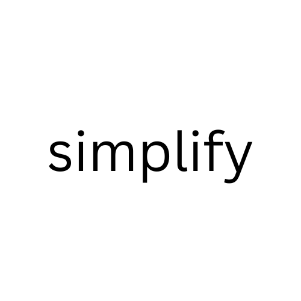
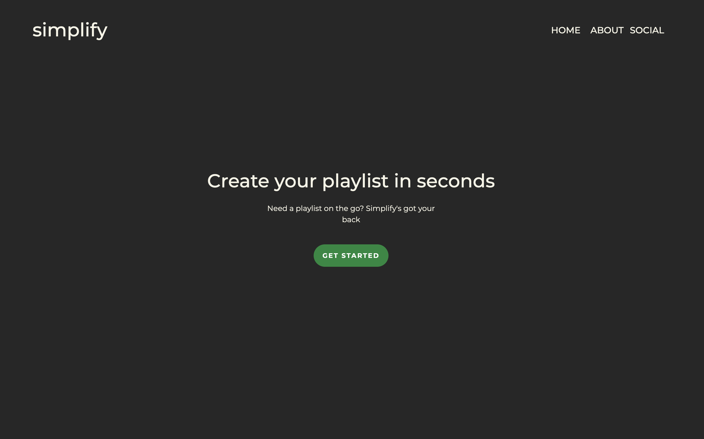
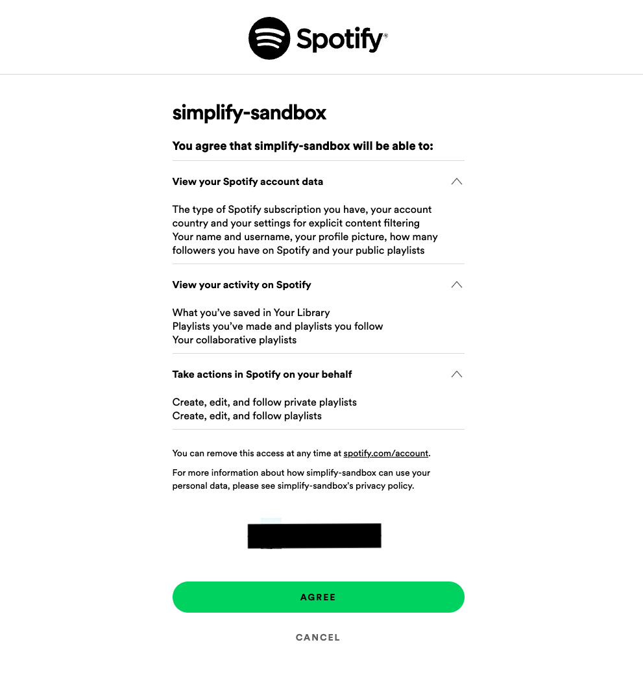

<a href="https://www.linkedin.com/in/yamato-eguchi">![LinkedIn][LinkedIn-Shield]</a>

<!-- PROJECT LOGO -->
 

  
  

    <a href="#demo">View Demo</a>
  

<!-- ABOUT THE PROJECT -->
## About The Project

Ever wanted to create a Spotify playlist on the go? Or a playlist starter? I programmed a web app that does just that!

Playlist creation has become a tedious task for me on Spotify. It takes hours to construct the perfect bucket of songs that matches a certain vibe or feel. I'm sure we've all been there before. Public playlists are a good start, but what if I ONLY want pieces I have interacted with before?

To tackle this, I used the Spotify API and some data science to output relevant songs for the options that you select. (Check out the <a href="#demo">demo</a>). The web app connects to your Spotify account and gives you an option to add the playlist generated to your library. This opens up many doors for users as it can serve as a playlist starter or a playlist on-the-go.

I generated user-relevant playlists by applying TF-IDF on track genres to crunch its relevancy and weight and using cosine similarity to rank tracks according to its similarity to a criteria.

(<a href="#readme-top">back to top</a>)

<!-- Post Mortem --> 
## Post Retrospective
### Successes
Here are a few milestones I hit during the three months of developing this app:
<ul>
  <li>
    Learned four new languages: <b>Python, JavaScript, HTML, CSS</b>
  </li>
  <li>
    Learned the foundation of both frontend and backend programming in web development, and applied them
  </li>
  <li>
    Applied the steps involved in data analysis: data retrieval, data cleaning, data processing and intrepretation of results
  </li>
  <li>
    Learned the importance of receiving user input and feedback
  </li>
</ul>

### Failures
I had many roadblocks and failures while developing the app. I failed to:
<ul>
  <li>
    Implement a secure database
  </li>
  <li>
    Maximize efficiency - app takes up to 30 seconds to initialize
  </li>
  <li>
    Have complete error handling
  </li>
  <li>
    Store user information securely
  </li>
</ul>
I have looked into each issues, and have began implementing solutions in other projects.

### Key take aways
Prior to this project, I had no web-development or data science experience. However, within three months, I was able to create a functioning product that applies both. Although not perfect, I learned many valuable lessons that I can apply to future projects. The following are my key take-aways:
<ul>
  <li>
    Know what you don't know
  </li>
  <li>
    Set realistic goals and stick to them
  </li>
  <li>
    Focus on the right things
  </li>
  <li>
    Think about the users
  </li>
  <li>
    Garbage in, garbage out
  </li>
  <li>
    Learn to learn <b>fast</b>!
  </li>
  <li>
    Read. The. Docs!
  </li>
</ul>

(<a href="#readme-top">back to top</a>)

<!-- CONTACT -->
## Contact
For any questions in regards to my project, please contact me.

Yamato Eguchi - [@yeguchi_dev](https://twitter.com/yeguchi_dev) - yamatoe1227@gmail.com

 

<!-- MARKDOWN LINKS & IMAGES -->
<!-- https://www.markdownguide.org/basic-syntax/#reference-style-links -->
[contributors-shield]: https://img.shields.io/github/contributors/github_username/repo_name.svg?style=for-the-badge
[contributors-url]: https://github.com/github_username/repo_name/graphs/contributors
[forks-shield]: https://img.shields.io/github/forks/github_username/repo_name.svg?style=for-the-badge
[forks-url]: https://github.com/github_username/repo_name/network/members
[stars-shield]: https://img.shields.io/github/stars/github_username/repo_name.svg?style=for-the-badge
[stars-url]: https://github.com/github_username/repo_name/stargazers
[issues-shield]: https://img.shields.io/github/issues/github_username/repo_name.svg?style=for-the-badge
[issues-url]: https://github.com/github_username/repo_name/issues
[license-shield]: https://img.shields.io/github/license/github_username/repo_name.svg?style=for-the-badge
[license-url]: https://github.com/github_username/repo_name/blob/master/LICENSE.txt
[linkedin-shield]: https://img.shields.io/badge/-LinkedIn-black.svg?style=for-the-badge&logo=linkedin&colorB=555
[linkedin-url]: https://linkedin.com/in/linkedin_username
[product-screenshot]: images/screenshot.png
[Next.js]: https://img.shields.io/badge/next.js-000000?style=for-the-badge&logo=nextdotjs&logoColor=white
[Next-url]: https://nextjs.org/
[React.js]: https://img.shields.io/badge/React-20232A?style=for-the-badge&logo=react&logoColor=61DAFB
[React-url]: https://reactjs.org/
[Vue.js]: https://img.shields.io/badge/Vue.js-35495E?style=for-the-badge&logo=vuedotjs&logoColor=4FC08D
[Vue-url]: https://vuejs.org/
[Angular.io]: https://img.shields.io/badge/Angular-DD0031?style=for-the-badge&logo=angular&logoColor=white
[Angular-url]: https://angular.io/
[Svelte.dev]: https://img.shields.io/badge/Svelte-4A4A55?style=for-the-badge&logo=svelte&logoColor=FF3E00
[Svelte-url]: https://svelte.dev/
[Laravel.com]: https://img.shields.io/badge/Laravel-FF2D20?style=for-the-badge&logo=laravel&logoColor=white
[Laravel-url]: https://laravel.com
[Bootstrap.com]: https://img.shields.io/badge/Bootstrap-563D7C?style=for-the-badge&logo=bootstrap&logoColor=white
[Bootstrap-url]: https://getbootstrap.com
[JQuery.com]: https://img.shields.io/badge/jQuery-0769AD?style=for-the-badge&logo=jquery&logoColor=white
[JQuery-url]: https://jquery.com 

## Demo

<ol>
  <h3><li>Once on the landing page, click "Get Started".</li></h3>

    

  <h3><li>You will be prompted to log in to your Spotify.</li></h3>
  

    

  <h3><li>Once logged in, it will take up to a minute to initialize.</li></h3>

  <h3><li>Click through the green buttoned options to select the playlist of your choice.</li></h3>

<h3><li>To add the playlist to your Spotify Library, scroll down and click "Add to Playlist".</li></h3>

<h3><li>Go to your Spotify Playlist Library and enjoy!</li></h3>

(<a href="#readme-top">back to top</a>)

